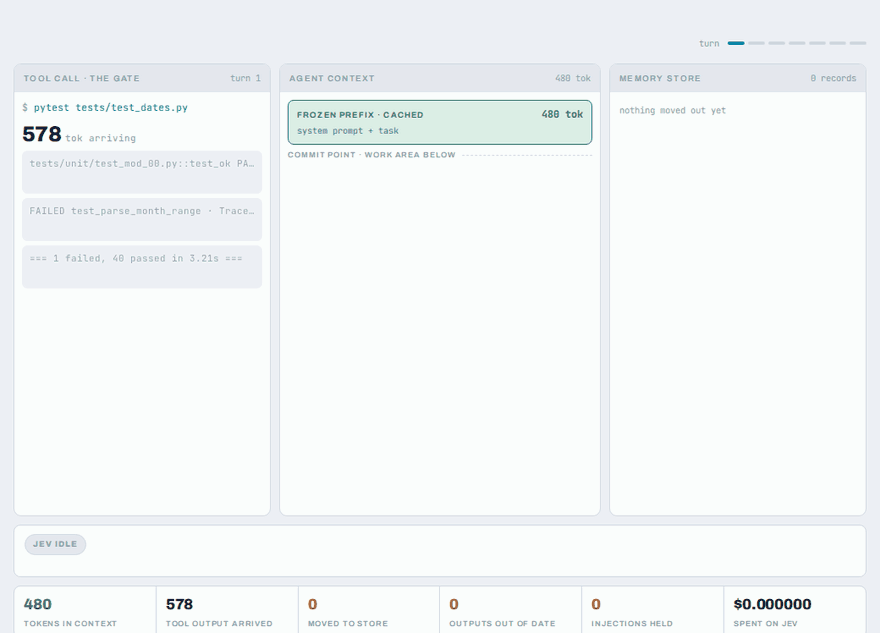

# jev-compaction

**Jev decides what a coding agent keeps in its context. It can score text but never
write it, so everything the agent sees is original, and anything moved out can be
brought back byte for byte.**

[](https://waxmell114514.github.io/jev-compaction/)

**[▶ How it works, and what it did on SWE-bench](https://waxmell114514.github.io/jev-compaction/)**,
or run the tour locally with no API key:

```bash
git clone https://github.com/Waxmell114514/jev-compaction && cd jev-compaction
uv venv .venv && uv pip install --python .venv/bin/python -e '.[dev]'
.venv/bin/python demo.py
```

## The problem

An agent's context fills up with tool output: test logs, file listings, whole
source files. The usual fix is to have a model *summarise* old turns. Two things go
wrong:
- Rewriting the middle of the transcript **breaks the provider's prompt cache**,
  so every later turn pays full price again.
- A summary is **generated text**. A detail the model invents becomes the agent's
  memory.

Three ways to make a context smaller, and what each costs:

| | can invent facts? | recoverable? | prompt cache survives? |
|---|---|---|---|
| LLM summarisation | **Yes**: the summary is generated text | No: the original is gone | No: the middle is rewritten |
| Delete-based pruning | No | No: deleted is deleted | No: dropping old turns rewrites the prefix |
| **This repo** | No: kept lines are the originals | **Yes**: `expand` returns the bytes | **Yes**: the prefix only grows; a later rewrite happens only when it pays for itself |

## What this does instead

Five mechanisms, in the order a tool output meets them. All of them are in the
Python library [`jevctx`](jevctx), and all of them are available to any harness
through a small HTTP sidecar. The [OpenCode plugin](integrations/opencode) uses the
sidecar.

| | mechanism | module |
|---|---|---|
| 1 | **Admission with a profile.** Tool output is split into segments. One Jev request asks each segment whether to keep it, what type it is (source, test output, traceback…), what role it plays (the code to change, evidence, navigation, noise…), how long it will matter, and whether it is a prompt injection. Low-value runs become a one-line pointer that says what it hides. Injections are quarantined. Optionally, each output is also judged against what the agent was looking for when it made the call (its *intent*). | [`pipeline`](jevctx/pipeline.py), [`profile`](jevctx/profile.py) |
| 2 | **Getting it back.** `expand` returns the text behind a pointer byte for byte. `recall` finds earlier output from a loose description, even output that has left the context. It filters on the profile, shortlists lexically, and has Jev rerank. | [`pipeline`](jevctx/pipeline.py), [`recall`](jevctx/recall.py) |
| 3 | **Supersession.** From each tool call's arguments, with no Jev call, it records which earlier outputs a later call made obsolete: the same command run again, the same lines read again, or the file edited since. | [`supersede`](jevctx/supersede.py) |
| 4 | **The work area.** The transcript is a frozen, cached prefix plus a work area after the last commit point. Before each request, work-area outputs that have served their purpose, and obsolete outputs anywhere, become pointers, but only when `dropped × turns left × cache price` beats `rest of the tail × (input − cache price)`. The rewrite applies to the request; the stored conversation is never changed. | [`workarea`](jevctx/workarea.py) |
| 5 | **Calibration.** Every decision is logged. Thresholds per tool and segment kind are fitted from what the agent later used. | [`shadow`](jevctx/shadow.py), [`calibrate`](jevctx/calibrate.py) |

## What it did

On SWE-bench Verified with OpenCode ([RESULTS.md](RESULTS.md) has the setup,
intervals and caveats):
- **Cleaner context.** The gate removed about a quarter of tool output at
  admission. Resolve rates were unchanged: 20/23 against 20/23 for the profiled
  gate.
- **Fewer mistakes.** Gating on *what a segment is for* halved how often code the
  agent later edited had been elided: 11 records against 21. Offline, the loss fell
  from 14% to 9% at the same savings.
- **Injection.** 17 of 18 planted instructions were caught, with no false
  positives in 2,499 real segments.
- **Recall.** With ~200 stored outputs, `recall` found the target in the top 3 for
  80% of queries (49% for BM25), and 69% when the query had no identifiers (18%).
- **The work area.** Requests were 16–17% smaller (10–12% on comparable runs),
  and about 10% cheaper on comparable runs at a $3 / $0.30 price sheet.
- **Supersession.** A fifth of all tool output goes stale through the agent's own
  edits.

The bill moves less than the context does. It is set by how many turns a task
takes and by cache prices, and whether a rewrite pays depends on how long the
session will still run.

## Use it

**Point it at Jev.** Jev is served by TypeSafe and by
[OpenRouter](https://openrouter.ai/typesafe), with the same API:

```bash
export TYPESAFE_API_KEY=...                        # TypeSafe (the default)
# or
export JEV_BASE_URL=https://openrouter.ai/api/alpha OPENROUTER_API_KEY=sk-or-...
.venv/bin/python -m jevctx.check                   # one live request of each kind
```

| variable | default |
|---|---|
| `JEV_BASE_URL` | `https://api.typesafe.ai/v1`; any URL that serves the same API |
| `JEV_API_KEY` | `TYPESAFE_API_KEY`, or `OPENROUTER_API_KEY` when the URL is OpenRouter's |
| `JEV_MODEL` | `jev-latest`, or `~typesafe/jev-latest` on OpenRouter |
| `JEV_PATH` | `/systemone`, or `/decisions` on OpenRouter |

`HttpJevClient(api_key=, base_url=, model=, path=)` takes the same settings as
arguments. Everything below uses them: the sidecar, `run_agent.py` and `demo.py`.

**Or use another model as the judge.** Every mechanism asks its questions through
one interface: yes/no, pick-one or ordered-scale questions about a piece of state.
Jev answers them natively. [`LLMJudgeClient`](jevctx/judge.py) has any
OpenAI-compatible chat model answer them in JSON, whether it is a hosted API or a
local server:

```bash
export JEVCTX_JUDGE=llm JUDGE_BASE_URL=https://api.openai.com/v1 JUDGE_MODEL=gpt-5-mini JUDGE_API_KEY=...
# or local, no key: JUDGE_BASE_URL=http://localhost:11434/v1 JUDGE_MODEL=qwen3:4b
.venv/bin/python -m jevctx.check
```

| variable | meaning |
|---|---|
| `JEVCTX_JUDGE` | `jev` (default) or `llm` |
| `JUDGE_BASE_URL`, `JUDGE_MODEL` | required for `llm` |
| `JUDGE_API_KEY` | sent as a bearer token; omit it for a server that needs none |
| `JUDGE_JSON_MODE=0` | for a server that rejects `response_format` |
| `JUDGE_RPM` | cap on requests per minute |

`make_judge()` builds whichever judge the environment names. The sidecar,
`run_agent.py`, `demo.py` and `jevctx.check` all use it. Every number on this page
was measured with Jev. A chat model gives its own probability estimates, so fit the
thresholds for your judge from a shadow log (`python -m jevctx.calibrate`) before
turning the gate on. Each judge request costs that model's price per token.

**In your own agent loop:**

```python
from jevctx import (GateConfig, InMemoryStore, Origin, ShadowLog, SupersessionIndex,
                    admit, expand, make_judge, recall)

store, log, jev = InMemoryStore(), ShadowLog("shadow.jsonl"), make_judge()   # Jev, or JEVCTX_JUDGE
gate = GateConfig(profile=True, gate_on="role:change_site", shadow_only=True)   # start in shadow

result = admit(tool_output, Origin(source="tool:bash", ref=call_id, turn=turn),
               task_digest=task, turn=turn, client=jev, store=store, log=log, config=gate)
# result.text goes into the context. Offer `expand` (and `recall`) as tools.
```

Start with `shadow_only=True`. It scores and logs everything but changes nothing.
Replay the log to choose thresholds, then turn it on.

**Goal conditioning.** The task says what the whole session is for, not what one
call was for. A 2,000-line file read to find one function is mostly worth keeping
for the task, and mostly beside the point of that read. Pass the agent's intent for
the call, and the judge is asked about both:

```python
result = admit(tool_output, origin, task_digest=task, turn=turn, client=jev, store=store,
               log=log, config=gate, intent="Let me find where parse_month checks the range")
```

The intent can be the model's own words before the call: `run_agent(intent="reply")`,
`JEV_INTENT=1` in the OpenCode plugin, or `"intent"` in the sidecar's `/admit`. It can
also be an argument the model fills in, as in
[SWE-Pruner](https://arxiv.org/abs/2601.16746): `run_agent(intent="arg")` adds an
optional `intent` parameter to every tool and strips it before the tool runs. Without
an intent, requests are exactly as before. Thresholds fitted without intents may not
fit with them: fit them from shadow runs made with intents (the log records each
decision's). This has not yet been measured on SWE-bench.

**With an OpenAI-compatible model.** [`jevctx.agent.run_agent`](jevctx/agent.py) is
a complete tool loop with every mechanism above. `run_agent.py` wraps it for
read-only tasks over files you name:

```bash
export OPENAI_BASE_URL=https://YOUR-ENDPOINT/v1 OPENAI_MODEL=YOUR-MODEL OPENAI_API_KEY=...
export TYPESAFE_API_KEY=...        # or JEV_BASE_URL + OPENROUTER_API_KEY, or JEVCTX_JUDGE=llm
python run_agent.py "Find the dependency conflict" --file tests/fixtures/npm_install.log \
    --mode on --profile --gate-on role:change_site --workarea --intent reply \
    --prices 3 15 0.3 0 --output runs/gated
```

`--mode off | shadow | on`; `--workarea` prices rewrites with `--prices`;
`--intent off | reply | arg` sets goal conditioning.
`run.json` reports usage, cost, `expand` and `recall` counts, relations and
work-area decisions.

**With OpenCode:** run the sidecar and install the plugin. See
[integrations/opencode](integrations/opencode).

**From any other harness:** `python -m jevctx.serve` exposes `/admit`, `/observe`,
`/expand`, `/recall`, `/workarea` and `/stats` over HTTP. See the docstring of
[`jevctx/serve.py`](jevctx/serve.py).

## Layout

| path | what |
|---|---|
| [`demo.py`](demo.py) | the offline tour, one act per mechanism |
| [`jevctx/`](jevctx) | the library: gate, profile, recall, supersession, work area, calibration, sidecar, agent loop |
| [`integrations/opencode/`](integrations/opencode) | the OpenCode plugin |
| [`docs/index.html`](docs/index.html) | the page linked above |
| [`RESULTS.md`](RESULTS.md) | the SWE-bench numbers |
| [`docs/spec-memory-core.md`](docs/spec-memory-core.md) | the memory-core design notes |

## Not built yet

- **An estimate of how long the session will still run.** It should come from the
  task's progress rather than a fixed prior. It decides whether a work-area rewrite
  pays.
- **Bayesian threshold updates.** These would combine Jev's score with each record's
  observed use.
- **Tiered memory.** This would promote what keeps being recalled.
